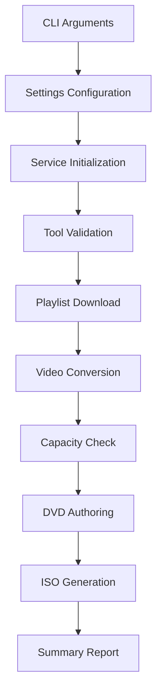

# DVD Maker Architecture Documentation

## Overview

DVD Maker is a Python command-line tool that converts YouTube playlists into physical DVDs. The application follows a clean layered architecture with clear separation of concerns, dependency injection, and comprehensive error handling.

## Architectural Patterns

### Layered Architecture

The codebase implements a traditional layered architecture:

```
┌─────────────────────────────────────────┐
│           Presentation Layer            │
│              (main.py)                  │
├─────────────────────────────────────────┤
│          Business Logic Layer           │
│              (services/)                │
├─────────────────────────────────────────┤
│             Data Layer                  │
│              (models/)                  │
├─────────────────────────────────────────┤
│         Infrastructure Layer            │
│          (utils/, config/)              │
└─────────────────────────────────────────┘
```

### Dependency Injection

All services use constructor-based dependency injection, receiving dependencies like `Settings`, `CacheManager`, and `ToolManager` during initialization rather than creating them internally. This enables:

- Easy unit testing with mock dependencies
- Flexible configuration management
- Clear dependency relationships
- Better maintainability

## Core Components

### Services Layer (`src/services/`)

#### VideoDownloader
- **Purpose**: YouTube playlist extraction and video downloading
- **Key Features**:
  - Integration with yt-dlp for playlist metadata extraction
  - Individual video downloads with intelligent caching
  - Rate limiting to respect YouTube's API limits
  - Error handling for failed downloads with partial success support
- **Dependencies**: Settings, CacheManager, ToolManager

#### VideoConverter  
- **Purpose**: Convert videos to DVD-compatible formats
- **Key Features**:
  - ffmpeg integration for MPEG-2 video, AC-3 audio conversion
  - Automatic format detection and appropriate parameter selection
  - Thumbnail generation for DVD menus
  - Comprehensive conversion metadata tracking
- **Dependencies**: Settings, CacheManager, ToolManager

#### DVDAuthor
- **Purpose**: Create complete DVD structures with menus
- **Key Features**:
  - DVD VIDEO_TS structure generation using dvdauthor
  - Automatic menu creation with video thumbnails
  - Chapter support for navigation
  - ISO image generation with mkisofs/genisoimage
  - DVD capacity validation and warnings
- **Dependencies**: Settings, CacheManager, ToolManager

#### CacheManager
- **Purpose**: Intelligent file caching and metadata management
- **Key Features**:
  - Atomic file operations to prevent corruption
  - SHA-256 checksum validation for integrity
  - Filename normalization and mapping
  - Metadata persistence for playlist and video information
  - Force-refresh capabilities for development/debugging
- **Dependencies**: Settings

#### ToolManager
- **Purpose**: External tool lifecycle management
- **Key Features**:
  - Automatic downloading of ffmpeg and yt-dlp to local bin/
  - Tool version tracking and validation
  - Platform-specific binary selection
  - System tool fallback capabilities
  - Installation instruction generation for manual tools
- **Dependencies**: Settings

#### CleanupManager
- **Purpose**: Selective cleanup of cached data
- **Key Features**:
  - Preview mode showing what will be deleted
  - Granular cleanup options (downloads, conversions, DVDs, ISOs)
  - User confirmation for safety
  - Comprehensive cleanup statistics reporting
- **Dependencies**: Settings

### Data Models (`src/models/`)

#### Video Models
- **VideoMetadata**: Immutable video information (ID, title, duration, URL)
- **VideoFile**: File-based video representation with size and format tracking
- **Validation**: Comprehensive input validation with meaningful error messages

#### Playlist Models  
- **PlaylistMetadata**: Container for playlist information
- **Playlist**: Collection of videos with status tracking and availability filtering
- **Features**: Support for partial success scenarios and status reporting

#### DVD Models
- **DVDStructure**: Complete DVD layout representation
- **DVDChapter**: Individual video chapter with navigation support
- **AuthoredDVD**: Final DVD output with VIDEO_TS and optional ISO

### Utilities Layer (`src/utils/`)

#### Cross-Cutting Concerns
- **logging.py**: Structured JSON logging with correlation IDs and context tracking
- **progress.py**: Flexible progress reporting with console, silent, and callback implementations
- **capacity.py**: DVD capacity calculations and video selection algorithms
- **filename.py**: ASCII normalization for DVD filesystem compatibility
- **platform.py**: Cross-platform detection and tool URL resolution
- **time_format.py**: Human-readable duration formatting

### Configuration (`src/config/`)

- **settings.py**: Centralized configuration management with environment variable support
- **Features**: Type validation, default values, directory management, and serialization

## Data Flow Architecture

### Main Workflow Pipeline



### Detailed Processing Flow

1. **Configuration Phase**
   - Parse CLI arguments
   - Merge with configuration files and environment variables
   - Set up structured logging with correlation IDs
   - Create necessary directories

2. **Tool Validation Phase**
   - Check for required external tools (ffmpeg, yt-dlp, dvdauthor)
   - Auto-download missing tools when possible
   - Validate tool functionality
   - Update to latest yt-dlp version if available

3. **Download Phase**
   - Extract playlist metadata from YouTube
   - Download individual videos with caching
   - Track download progress and handle failures gracefully
   - Generate normalized filenames for DVD compatibility

4. **Conversion Phase**
   - Convert videos to DVD-compatible MPEG-2 format
   - Generate AC-3 audio streams
   - Create thumbnail images for menu navigation
   - Cache converted files to avoid reprocessing

5. **Capacity Management Phase**
   - Calculate total size of converted videos
   - Apply DVD capacity constraints (4.7GB standard)
   - Select videos that fit, excluding excess with user notification
   - Maintain video quality preference ordering

6. **DVD Creation Phase**
   - Generate DVD menu XML structure
   - Create VIDEO_TS directory with dvdauthor
   - Copy video files into appropriate VOB containers
   - Generate navigation metadata (IFO/BUP files)

7. **ISO Generation Phase** (Optional)
   - Create ISO image from VIDEO_TS structure
   - Support both mkisofs and genisoimage tools
   - Generate filesystem-compatible ISO 9660 format

## Error Handling Strategy

### Exception Hierarchy

Each service defines specific exception types following a consistent pattern:

```python
# Base service errors
YtDlpError(Exception)                    # VideoDownloader
VideoConverterError(Exception)          # VideoConverter  
DVDAuthorError(Exception)               # DVDAuthor
ToolManagerError(Exception)             # ToolManager
```

### Error Recovery Patterns

- **Partial Success**: Continue processing remaining items when individual items fail
- **Atomic Operations**: Use temporary files and atomic moves for file operations
- **Graceful Degradation**: Provide fallback options when possible
- **User Feedback**: Clear error messages with actionable guidance

## Caching Architecture

### Multi-Level Caching Strategy

```
┌─────────────────┐    ┌─────────────────┐    ┌─────────────────┐
│   Download      │    │   Conversion    │    │   Metadata      │
│     Cache       │    │     Cache       │    │     Cache       │
├─────────────────┤    ├─────────────────┤    ├─────────────────┤
│ • Original MP4  │    │ • DVD MPEG-2    │    │ • Video info    │
│ • Rate limited  │    │ • Thumbnails    │    │ • Playlist data │
│ • Checksums     │    │ • Validated     │    │ • Mappings      │
└─────────────────┘    └─────────────────┘    └─────────────────┘
```

### Cache Features

- **Integrity Verification**: SHA-256 checksums for all cached files
- **Atomic Operations**: Temporary files prevent corruption during updates
- **Smart Invalidation**: Force-refresh options for development and troubleshooting
- **Filename Mapping**: ASCII normalization with original name preservation

## Progress Reporting Architecture

### Callback Pattern Hierarchy

```python
class ProgressCallback(ABC):
    def update(progress: ProgressInfo) -> None
    def complete(message: str) -> None  
    def error(message: str) -> None

# Implementations:
# - ConsoleProgressCallback: Animated progress bars
# - SilentProgressCallback: No-op for testing
# - CallbackProgressCallback: Custom function integration
```

### Multi-Step Progress Tracking

- **ProgressTracker**: Single operation with cancellation support
- **MultiStepProgressTracker**: Weighted progress across pipeline stages
- **Thread Safety**: All progress implementations are thread-safe

## Testing Architecture

### Comprehensive Test Strategy

- **Unit Tests**: 429+ tests covering individual components
- **Integration Tests**: Cross-component interaction testing
- **Concurrent Tests**: Multi-threading and file locking validation
- **Coverage Requirement**: >90% test coverage maintained

### Test Patterns

- **Mock-Heavy Testing**: External dependencies mocked for isolation
- **Fixture-Based Setup**: Consistent test data and environments
- **Property-Based Validation**: Comprehensive input validation testing

## Opportunities for Refactoring

### Remaining Areas for Improvement

#### 1. Progress Callback Consolidation

**Issue**: Multiple services define their own `ProgressCallback` types instead of using the comprehensive class hierarchy in `utils/progress.py`.

**Files Affected**:
- `src/services/converter.py:22`
- `src/services/tool_manager.py:29`
- `src/services/dvd_author.py:27`

**Recommended Solution**:
```python
# Remove duplicate type definitions
from src.utils.progress import ProgressCallback

# Update service constructors to use the proper class
def __init__(self, callback: Optional[ProgressCallback] = None):
    self.callback = callback or SilentProgressCallback()
```

### Completed Improvements

#### 1. Service Base Class Pattern ✅ **COMPLETED**

**Issue**: All services followed similar initialization patterns with settings injection and logging setup.

**Implemented Solution**: Created a common `BaseService` class that provides shared functionality for all DVD Maker services.

**Changes Made**:
- Created `src/services/base.py` with `BaseService` class providing settings injection and logging setup
- Updated all service classes (`CacheManager`, `VideoConverter`, `VideoDownloader`, `DVDAuthor`, `ToolManager`) to inherit from `BaseService`
- Added common operation logging methods (`_log_operation_start`, `_log_operation_complete`, `_log_operation_error`)
- Maintained backward compatibility by making settings parameter optional in `CacheManager`
- Created comprehensive tests to verify inheritance and functionality
- All services now share consistent initialization patterns while maintaining their domain-specific functionality

**Result**: Eliminated code duplication in service initialization, provided consistent logging patterns, and established a foundation for future shared service functionality.

#### 2. Tool Path Resolution Duplication ✅ **COMPLETED**

**Issue**: Tool path resolution logic was duplicated across services that use external tools.

**Implemented Solution**: Centralized tool path resolution in `ToolManager` and provided a consistent interface for all services.

**Changes Made**:
- Refactored `VideoDownloader`, `VideoConverter`, and `DVDAuthor` to use `ToolManager.get_tool_command()`
- Removed duplicate tool path resolution logic from individual services
- Standardized tool availability checking through `ToolManager.is_tool_available_locally()`
- Enhanced error handling for missing tools with centralized messaging
- Updated all tests to reflect the new centralized architecture

**Result**: Eliminated code duplication, improved maintainability, and provided consistent tool management across all services.

#### 3. Error Hierarchy Consolidation ✅ **COMPLETED**

**Issue**: While each service had well-defined exceptions, they could benefit from a common base class for consistent error handling.

**Implemented Solution**: Created a common base exception class while keeping each service's exceptions defined in their own domain modules.

**Changes Made**:
- Created `DVDMakerError` base exception in `src/exceptions.py` with optional context support
- Updated all service exceptions to inherit from `DVDMakerError` while keeping them in their respective modules
- Enhanced error string representation to include context information
- Added comprehensive tests for the exception hierarchy
- Maintained domain separation - each service keeps its own exception definitions

**Result**: All DVD Maker exceptions now share a common base class with consistent context support, enabling better error handling patterns while preserving domain boundaries.

### Code Quality Improvements

#### 1. Configuration Validation Enhancement

**Current**: Settings validation is scattered across individual field validators
**Recommended**: Implement comprehensive validation strategy with clear error reporting

#### 2. Logging Context Standardization

**Current**: Correlation IDs and context are manually managed
**Recommended**: Implement structured logging context manager for automatic context injection

#### 3. Resource Management Consistency

**Current**: File handle and process management varies across services
**Recommended**: Implement consistent resource management patterns with context managers

## Security Considerations

### Current Security Features

- **Input Validation**: Comprehensive validation of all user inputs
- **Safe File Operations**: Atomic file operations prevent corruption
- **Tool Isolation**: External tools run in controlled environments
- **Path Sanitization**: All file paths are validated and sanitized

### Security Recommendations

1. **Dependency Pinning**: Pin external tool versions for reproducible builds
2. **Input Sanitization**: Enhanced validation for playlist URLs and file paths
3. **Resource Limits**: Implement disk space and processing time limits
4. **Audit Logging**: Enhanced logging for security-relevant operations

## Performance Characteristics

### Optimizations Implemented

- **Intelligent Caching**: Avoid redundant downloads and conversions
- **Parallel Processing**: Multiple operations can run concurrently where safe
- **Memory Management**: Streaming operations for large files
- **Tool Efficiency**: Optimal parameters for external tool performance

### Performance Monitoring

- **Operation Timing**: Comprehensive timing information in logs
- **Resource Usage**: Tracking of disk space and processing requirements
- **Progress Reporting**: Real-time feedback on long-running operations

## Deployment Architecture

### Directory Structure

```
dvdmaker/
├── bin/           # Auto-downloaded tools (ffmpeg, yt-dlp)
├── cache/         # Intelligent caching system
│   ├── downloads/     # Original YouTube videos
│   ├── converted/     # DVD-compatible videos
│   └── metadata/      # Playlist and video metadata
├── output/        # Final DVD structures and ISOs
├── temp/          # Temporary processing files
└── logs/          # Structured application logs
```

### System Requirements

- **Python**: 3.10+ with modern typing support
- **External Tools**: dvdauthor (system-installed), ffmpeg and yt-dlp (auto-downloaded)
- **Disk Space**: ~2x playlist size for caching and processing
- **Platform Support**: Linux and macOS (Intel/Apple Silicon)

## Conclusion

The DVD Maker architecture demonstrates excellent software engineering practices with a clean, maintainable design. The modular structure with dependency injection enables comprehensive testing and future extensibility. The robust error handling, caching, and logging systems show strong production-readiness considerations.

The identified refactoring opportunities are relatively minor improvements that would enhance code reuse and maintainability without requiring significant architectural changes. The current architecture effectively supports the complex workflow requirements while maintaining clear separation of concerns and providing excellent user experience through comprehensive progress reporting and error handling.